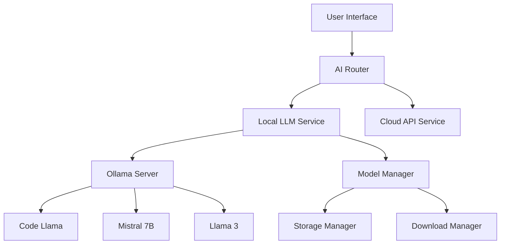
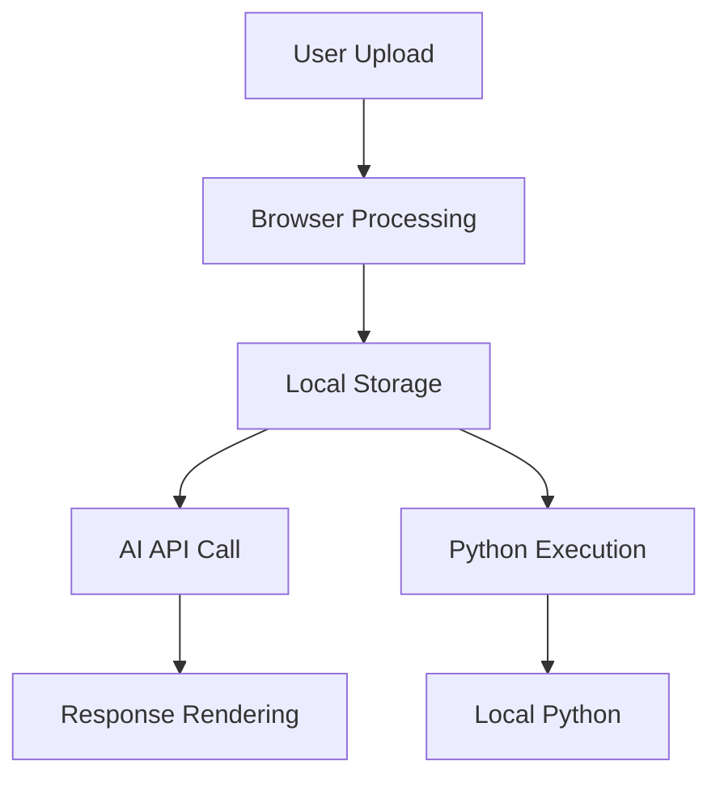
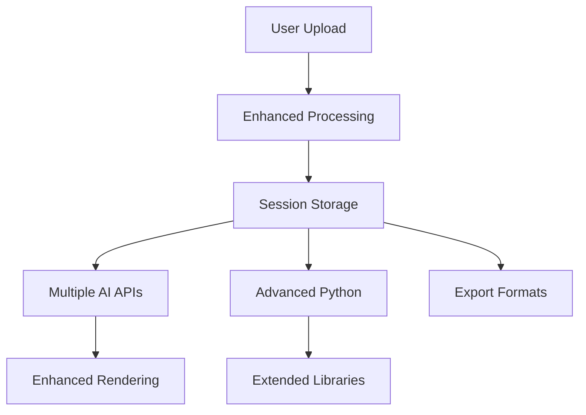
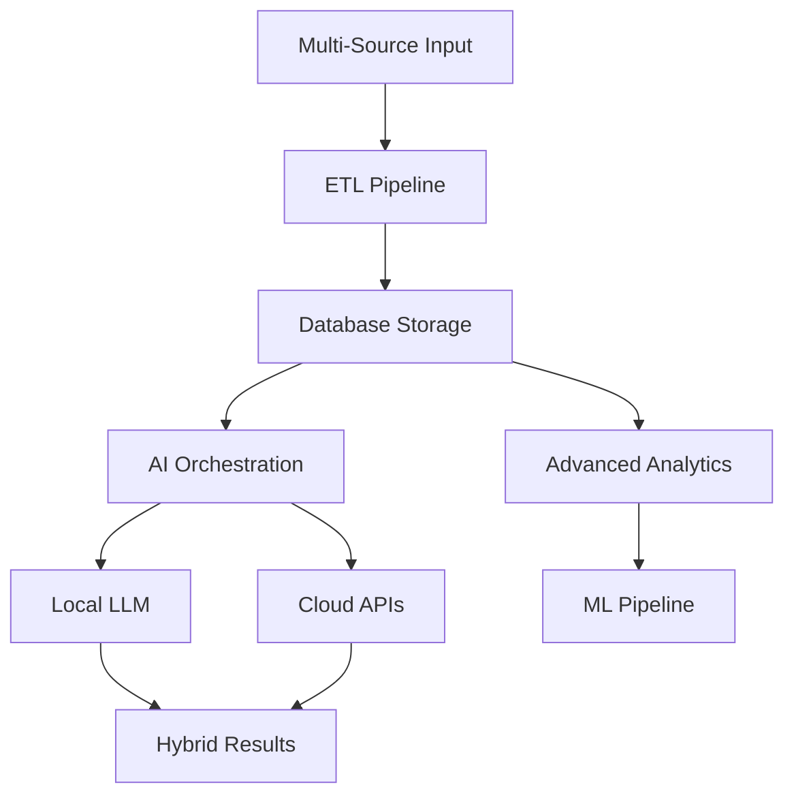
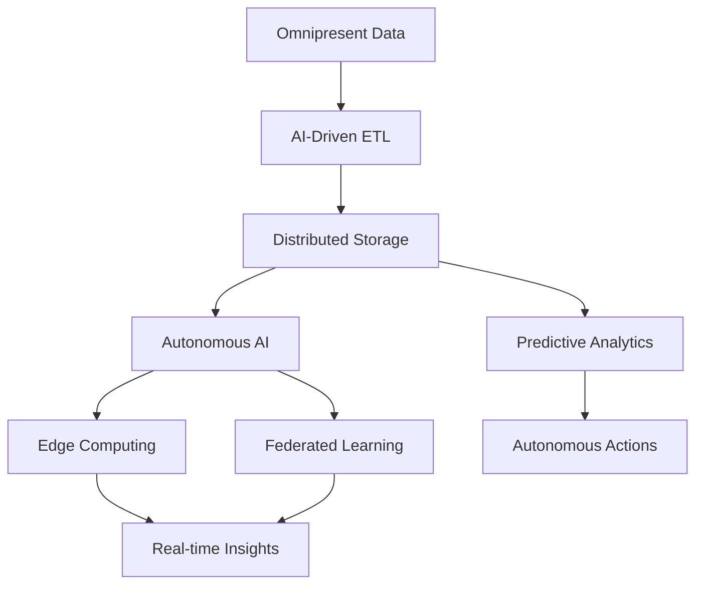

# Nemo - Technology Roadmap & Future Development

## 📋 Table of Contents

- [Vision & Mission](#vision--mission)
- [Current State (v1.0)](#current-state-v10)
- [Short-Term Roadmap (v1.1-1.3)](#short-term-roadmap-v11-13)
- [Medium-Term Goals (v2.0-2.5)](#medium-term-goals-v20-25)
- [Long-Term Vision (v3.0+)](#long-term-vision-v30)
- [Local LLM Integration Plan](#local-llm-integration-plan)
- [Data Flow Evolution](#data-flow-evolution)
- [Technology Stack Evolution](#technology-stack-evolution)
- [Performance & Scalability](#performance--scalability)
- [Security & Privacy Enhancements](#security--privacy-enhancements)
- [User Experience Improvements](#user-experience-improvements)
- [Developer Experience](#developer-experience)
- [Community & Ecosystem](#community--ecosystem)

---

## Vision & Mission

### Mission Statement
To democratize data analysis by providing an intuitive, AI-powered platform that bridges the gap between complex statistical software and everyday users, while maintaining professional-grade capabilities for advanced analysis.

### Core Vision
- **Accessibility**: Make data analysis accessible to users regardless of technical background
- **Privacy-First**: Keep user data secure and private through local processing
- **Professional Grade**: Provide tools that meet the standards of statistical professionals
- **AI-Enhanced**: Leverage artificial intelligence to augment human analytical capabilities
- **Open & Extensible**: Build a platform that can grow and adapt to user needs

### Key Principles
1. **User-Centric Design**: Every feature should solve real user problems
2. **Data Privacy**: User data should never leave their control without explicit consent
3. **Performance First**: The application should be fast and responsive
4. **Cross-Platform**: Work seamlessly across different devices and operating systems
5. **Standards Compliance**: Follow established statistical and data science best practices

---

## Current State (v1.0)

### Implemented Features ✅

#### Core Data Processing
- **Multi-format support**: CSV, JSON, Excel (.xlsx, .xls) file upload
- **Client-side processing**: All data parsing happens in browser for privacy
- **Automatic type detection**: Smart recognition of numeric, text, and date data
- **Error handling**: Graceful handling of malformed or corrupted files

#### AI-Powered Analysis
- **Google Gemini integration**: Natural language querying with multiple model options
- **Contextual analysis**: AI understands dataset structure and provides relevant insights
- **Code generation**: Automatic Python code creation for statistical analysis
- **Markdown rendering**: Properly formatted AI responses with syntax highlighting

#### SPSS-Style Data Editor
- **Professional interface**: Data View and Variable View tabs
- **Direct editing**: Click-to-edit cells with keyboard navigation
- **Variable configuration**: Data types, labels, missing values, measurement scales
- **Find & Replace**: Search functionality with case sensitivity options
- **Excel-style navigation**: Column letters, keyboard shortcuts, smooth scrolling

#### Python Code Sandbox
- **Interactive environment**: Execute Python code with uploaded data
- **Pre-built templates**: Frequency analysis, descriptive statistics, t-tests
- **Syntax highlighting**: Professional code editor with Python support
- **Real-time execution**: Run code using local Python installation
- **Library support**: pandas, numpy, matplotlib, seaborn, scipy

#### Visualization Engine
- **Automatic charts**: Generated based on data types and patterns
- **Multiple chart types**: Bar charts, pie charts, line graphs, histograms
- **Statistical summaries**: Comprehensive data overviews
- **Responsive design**: Charts adapt to different screen sizes

#### User Interface
- **Two-panel layout**: File management and chat interface
- **Collapsible design**: Expandable/collapsible left panel
- **Theme support**: Light and dark mode options
- **Mobile responsive**: Works on tablets and mobile devices

### Current Limitations
- **Single-session data**: No persistence between browser sessions
- **No user accounts**: No authentication or user management
- **Limited collaboration**: No sharing or multi-user features
- **API dependency**: Requires external API for AI features
- **No database**: All data stored in browser memory
- **Single file analysis**: Can't easily compare multiple datasets

---

## Short-Term Roadmap (v1.1-1.3)

### v1.1 - Enhanced User Experience (Q2 2024)

#### Priority Features
- **Help System Integration** 🔄
  - Interactive help tooltips and guided tours
  - Context-sensitive help based on current user action
  - Video tutorials and interactive demos
  - Comprehensive help documentation with search

- **Advanced Search & Filter** 📊
  - Global search across all uploaded datasets
  - Advanced filtering options in data editor
  - Saved search queries and filters
  - Regex support for complex pattern matching

- **Export & Import Enhancements** 📤
  - Export analysis results as PDF reports
  - Excel export with formatting and charts
  - Import/export of analysis sessions
  - Batch file processing capabilities

#### Technical Improvements
- **Performance optimizations** for large datasets (>100MB)
- **Memory management** improvements
- **Error handling** enhancements
- **Accessibility** compliance (WCAG 2.1 AA)

### v1.2 - Collaboration Features (Q3 2024)

#### Sharing & Collaboration
- **Session sharing** via secure links
- **Export shareable reports** with embedded visualizations
- **Comment system** for data annotations
- **Version history** for data editing sessions

#### Advanced Analytics
- **Statistical significance testing** suite
- **Correlation analysis** with advanced options
- **Time series analysis** tools
- **Hypothesis testing** workflow

#### User Interface Enhancements
- **Custom dashboard creation**
- **Drag-and-drop chart builder**
- **Advanced theme customization**
- **Keyboard shortcut customization**

### v1.3 - Professional Tools (Q4 2024)

#### Advanced Data Editor
- **Data validation rules** and constraints
- **Conditional formatting** for data quality
- **Advanced pivot table** functionality
- **Merge and join** operations between datasets

#### Enhanced Python Environment
- **Package manager** for additional libraries
- **Jupyter notebook** interface integration
- **Code versioning** and history
- **Template marketplace** for community contributions

#### Visualization Improvements
- **Interactive plotly** integration
- **Custom chart templates**
- **Animation support** for time series
- **3D visualization** capabilities

---

## Medium-Term Goals (v2.0-2.5)

### v2.0 - Database Integration & Persistence (Q1 2025)

#### Core Infrastructure Changes
- **PostgreSQL with Supabase** backend implementation
- **User authentication** and account management
- **Persistent data storage** for datasets and analysis history
- **Real-time collaboration** features

#### Database Features
- **Project workspaces** for organizing related analyses
- **Dataset versioning** with change tracking
- **Automated backups** and recovery
- **Data lineage** tracking

#### Security Enhancements
- **Row-level security** (RLS) policies
- **Data encryption** at rest and in transit
- **Audit logging** for all data operations
- **GDPR compliance** features

### v2.1 - Advanced AI Integration (Q2 2025)

#### Enhanced AI Capabilities
- **Multi-model support**: OpenAI GPT, Claude, local models
- **AI model comparison** and benchmarking
- **Custom AI workflows** for specific analysis types
- **AI-powered data cleaning** and preparation

#### Smart Analysis Features
- **Automated insight discovery**
- **Anomaly detection** with ML models
- **Predictive modeling** wizard
- **Natural language report generation**

### v2.2 - Local LLM Integration (Q3 2025)

#### Local AI Processing
- **Ollama integration** for local LLM execution
- **Model download** and management system
- **Offline AI analysis** capabilities
- **Privacy-focused local processing**

See detailed [Local LLM Integration Plan](#local-llm-integration-plan) below.

### v2.3 - Enterprise Features (Q4 2025)

#### Enterprise Capabilities
- **Single Sign-On (SSO)** integration
- **Role-based access control** (RBAC)
- **Enterprise data connectors** (SQL Server, Oracle, etc.)
- **White-label deployment** options

#### Scalability & Performance
- **Microservices architecture**
- **Container deployment** with Docker/Kubernetes
- **Horizontal scaling** capabilities
- **CDN integration** for global performance

### v2.4 - Advanced Analytics Suite (Q1 2026)

#### Statistical Modeling
- **Machine learning** model building and deployment
- **Time series forecasting**
- **A/B testing** framework
- **Survival analysis** tools

#### Business Intelligence
- **KPI dashboard** builder
- **Automated reporting** scheduler
- **Alert system** for data changes
- **Executive summary** generation

### v2.5 - API & Integration Platform (Q2 2026)

#### Developer Platform
- **RESTful API** for external integrations
- **Webhook system** for real-time notifications
- **SDK development** for multiple languages
- **Plugin architecture** for extensibility

#### Third-Party Integrations
- **Google Sheets/Excel** live connections
- **Slack/Teams** notifications
- **Email reporting** automation
- **Cloud storage** integrations (S3, Google Drive, etc.)

---

## Long-Term Vision (v3.0+)

### v3.0 - AI-Native Analytics Platform (2026-2027)

#### Autonomous Analysis
- **AI Research Assistant**: Autonomous hypothesis generation and testing
- **Smart Data Discovery**: AI-powered data source identification and integration
- **Automated Model Selection**: ML model recommendation and optimization
- **Intelligent Visualization**: AI-driven chart and dashboard creation

#### Advanced Natural Language Processing
- **Voice interaction** with data analysis
- **Multi-language support** for global users
- **Domain-specific AI models** (healthcare, finance, marketing, etc.)
- **Context-aware analysis** based on user behavior and preferences

### Future Technology Integrations

#### Emerging Technologies
- **WebAssembly (WASM)** for high-performance computing
- **WebGPU** for GPU-accelerated analytics
- **Progressive Web App (PWA)** for offline-first experience
- **Web Streams API** for handling massive datasets

#### Next-Generation UI/UX
- **Augmented Reality (AR)** data visualization
- **Voice User Interface (VUI)** for hands-free analysis
- **Gesture-based interaction** for touch devices
- **Brain-computer interface** exploration for accessibility

---

## Local LLM Integration Plan

### Phase 1: Foundation (v2.2 - Q3 2025)

#### Core Infrastructure
```typescript
// Local LLM Service Architecture
interface LocalLLMService {
  models: AvailableModel[]
  downloadModel(modelId: string): Promise<void>
  loadModel(modelId: string): Promise<LoadedModel>
  generateResponse(prompt: string, context: any): Promise<string>
  unloadModel(modelId: string): Promise<void>
}
```

#### Supported Local Models
- **Code Llama**: Specialized for Python code generation and debugging
- **Mistral 7B**: General-purpose analysis and insights
- **Llama 2/3**: Advanced reasoning and statistical interpretation
- **CodeGen**: Enhanced code completion and optimization
- **WizardCoder**: Specialized statistical and data science coding

#### Integration Points
- **Ollama Backend**: Local model serving infrastructure
- **Model Download Manager**: Handle large model files efficiently
- **Fallback System**: Graceful fallback to cloud APIs when needed
- **Performance Monitoring**: Track local vs cloud performance metrics

### Phase 2: User Experience (v2.3 - Q4 2025)

#### Model Management Interface
```typescript
interface ModelManagerUI {
  availableModels: LocalModel[]
  downloadProgress: DownloadProgress[]
  storageUsage: StorageMetrics
  modelPerformance: PerformanceMetrics[]
}
```

#### Features
- **One-click model installation** with progress tracking
- **Storage management** with size estimates and cleanup tools
- **Performance comparison** between models and cloud APIs
- **Automatic model updates** with user approval

#### User Controls
- **Privacy toggle**: Choose between local and cloud processing
- **Model selection**: Pick optimal model for specific analysis types
- **Resource management**: Control CPU/memory usage for local processing
- **Offline mode**: Full functionality without internet connection

### Phase 3: Advanced Features (v2.4 - Q1 2026)

#### Hybrid Processing
```typescript
interface HybridProcessor {
  analyzeOptimalRoute(query: string, context: any): ProcessingRoute
  executeHybrid(query: string): Promise<AnalysisResult>
  combineResults(local: Result, cloud: Result): Promise<EnhancedResult>
}

enum ProcessingRoute {
  LOCAL_ONLY = 'local',
  CLOUD_ONLY = 'cloud', 
  HYBRID = 'hybrid',
  PARALLEL = 'parallel'
}
```

#### Smart Routing
- **Query complexity analysis**: Route simple queries locally, complex ones to cloud
- **Model capability matching**: Choose best model for specific question types
- **Performance-based routing**: Learn from past performance to optimize routing
- **Cost optimization**: Minimize cloud API usage while maintaining quality

#### Privacy Features
- **Data classification**: Identify sensitive data that should stay local
- **Selective processing**: Only send non-sensitive data to cloud APIs
- **Audit trail**: Track which data went where for compliance
- **Encryption**: Full encryption for any cloud-bound data

### Phase 4: Enterprise & Edge Computing (v3.0 - 2026-2027)

#### Enterprise Deployment
- **On-premises deployment**: Complete local installation for enterprises
- **Edge computing**: Deploy on edge devices for maximum privacy
- **Custom model training**: Fine-tune models on enterprise data
- **Air-gapped environments**: Full offline capability for secure environments

#### Advanced AI Workflows
- **Multi-model ensembles**: Combine multiple local models for better results
- **Continuous learning**: Models improve based on user feedback
- **Domain specialization**: Industry-specific model variants
- **Collaborative AI**: Models share insights while preserving privacy

### Technical Implementation Details

#### System Architecture


#### Resource Requirements
- **Minimum Hardware**: 8GB RAM, 4GB free disk space
- **Recommended Hardware**: 16GB RAM, 50GB free disk space, GPU optional
- **Model Sizes**: 2GB-13GB per model depending on capability
- **Network**: Required only for initial download and cloud fallback

#### Performance Targets
- **Local Response Time**: <5 seconds for simple queries
- **Download Speed**: Models download in background with pause/resume
- **Memory Usage**: <4GB additional RAM usage during inference
- **Battery Impact**: Minimal impact on laptop battery life

### Privacy & Security Benefits

#### Data Protection
- **Zero data transmission**: Sensitive analysis never leaves the device
- **No logging**: Local models don't log or store query history
- **Air-gapped capability**: Works completely offline if needed
- **User control**: Full control over which data is processed where

#### Compliance Features
- **GDPR compliance**: Data minimization and local processing
- **HIPAA support**: Healthcare data stays on-premise
- **SOX compliance**: Financial data protection
- **Custom policies**: Configurable data handling policies

---

## Data Flow Evolution

### Current Data Flow (v1.0)


### Short-Term Evolution (v1.1-1.3)


### Medium-Term Vision (v2.0-2.5)


### Long-Term Architecture (v3.0+)


---

## Technology Stack Evolution

### Current Stack (v1.0)
```
Frontend: Next.js 14, React 18, TypeScript, Tailwind CSS
UI: shadcn/ui, Lucide React
Processing: Client-side JavaScript, Web APIs
AI: Google Gemini API
Code Execution: Node.js child_process, local Python
State: React hooks, localStorage
```

### Short-Term Additions (v1.1-1.3)
```
Enhanced UI: React Query, Zustand for state management
Visualization: D3.js, Plotly.js
Export: jsPDF, ExcelJS
Search: Fuse.js, Lunr.js
Performance: Web Workers, Service Workers
Testing: Jest, React Testing Library, Playwright
```

### Medium-Term Evolution (v2.0-2.5)
```
Backend: Supabase, PostgreSQL, Prisma ORM
Authentication: Supabase Auth
Real-time: WebSockets, Server-Sent Events
AI: Multiple providers (OpenAI, Claude, local models)
Containers: Docker, Kubernetes
Monitoring: OpenTelemetry, Prometheus
Cache: Redis, CDN integration
```

### Long-Term Vision (v3.0+)
```
Edge: WebAssembly, WebGPU
AI: TensorFlow.js, ONNX.js, local inference engines
Streaming: Apache Kafka, event-driven architecture
ML Ops: MLflow, model versioning
Distributed: Microservices, service mesh
Security: Zero-trust architecture, end-to-end encryption
```

---

## Performance & Scalability

### Current Performance Baseline
- **File upload**: <2 seconds for 10MB files
- **Data parsing**: <5 seconds for 100K rows
- **AI response**: 2-10 seconds (API dependent)
- **Python execution**: 1-30 seconds (complexity dependent)
- **Visualization**: <1 second for standard charts

### Short-Term Performance Goals (v1.1-1.3)
- **Large file support**: 500MB+ files with streaming processing
- **Concurrent operations**: Multiple analyses running simultaneously
- **Memory optimization**: 50% reduction in memory usage
- **Caching**: Intelligent caching of AI responses and computations
- **Progressive loading**: Stream results as they become available

### Medium-Term Scalability (v2.0-2.5)
- **Multi-user support**: 1000+ concurrent users
- **Database optimization**: Sub-second queries on millions of records
- **Distributed processing**: Horizontal scaling for compute-intensive tasks
- **CDN integration**: Global content delivery for optimal performance
- **Real-time collaboration**: Sub-100ms latency for collaborative editing

### Long-Term Performance Vision (v3.0+)
- **Predictive caching**: AI-driven cache warming based on usage patterns
- **Edge computing**: Processing moved closer to users globally
- **Quantum-ready**: Prepared for quantum computing integration
- **Auto-scaling**: Dynamic resource allocation based on demand
- **Near-zero latency**: <50ms response times for all operations

### Performance Monitoring & Optimization

#### Metrics & KPIs
- **Core Web Vitals**: LCP, FID, CLS tracking
- **Custom Metrics**: Data processing speed, AI response time
- **User Experience**: Task completion rates, error frequencies
- **Resource Usage**: Memory, CPU, network utilization
- **Business Metrics**: User retention, feature adoption

#### Optimization Strategies
- **Code splitting**: Load only necessary code
- **Image optimization**: WebP, AVIF format support
- **Database optimization**: Query optimization, indexing
- **Caching layers**: Multiple levels of intelligent caching
- **Performance budgets**: Strict limits on bundle sizes

---

## Security & Privacy Enhancements

### Current Security Measures
- **Client-side processing**: Data stays in browser
- **HTTPS encryption**: Secure API communications
- **Input validation**: File type and size restrictions
- **Error handling**: No sensitive data in error messages
- **API key security**: Keys stored in localStorage only

### Short-Term Security Roadmap (v1.1-1.3)

#### Enhanced Client-Side Security
- **Content Security Policy (CSP)**: Prevent XSS attacks
- **Subresource Integrity (SRI)**: Verify third-party resources
- **Input sanitization**: Advanced validation and sanitization
- **Secure contexts**: HTTPS-only operations
- **Privacy controls**: Granular user privacy settings

#### Data Protection
- **Client-side encryption**: Encrypt sensitive data before storage
- **Secure key management**: Hardware security module (HSM) integration
- **Data retention policies**: Automatic data cleanup
- **Privacy dashboard**: User control over data handling
- **Anonymization**: Remove PII from analysis where possible

### Medium-Term Security Evolution (v2.0-2.5)

#### Enterprise Security
- **Zero-trust architecture**: Never trust, always verify
- **Multi-factor authentication**: 2FA/MFA for all accounts
- **Role-based access control**: Granular permissions system
- **Audit logging**: Comprehensive activity tracking
- **Compliance frameworks**: SOC 2, ISO 27001 certification

#### Data Sovereignty
- **Regional data residency**: Keep data in specific geographic regions
- **Data classification**: Automatic sensitivity level detection
- **Encryption at rest**: All stored data encrypted
- **Key rotation**: Automatic encryption key management
- **Right to be forgotten**: Complete data deletion capabilities

### Long-Term Security Vision (v3.0+)

#### Advanced Privacy Technologies
- **Homomorphic encryption**: Compute on encrypted data
- **Differential privacy**: Mathematical privacy guarantees
- **Secure multi-party computation**: Collaborative analysis without sharing data
- **Zero-knowledge proofs**: Verify computations without revealing data
- **Federated learning**: AI training without centralizing data

#### AI Security
- **Model poisoning protection**: Detect and prevent malicious training data
- **Adversarial attack defense**: Robust against AI manipulation attempts
- **Explainable AI**: Transparent AI decision making
- **Bias detection**: Automatic fairness and bias monitoring
- **AI governance**: Ethical AI use policies and enforcement

---

## User Experience Improvements

### Current UX State
- **Clean interface**: Minimal, professional design
- **Intuitive navigation**: Clear information hierarchy
- **Responsive design**: Works on desktop and mobile
- **Accessibility**: Basic screen reader support
- **Performance**: Fast loading and interactions

### Short-Term UX Goals (v1.1-1.3)

#### Usability Enhancements
- **Onboarding flow**: Interactive tutorial for new users
- **Contextual help**: Smart tips based on user actions
- **Keyboard shortcuts**: Power user efficiency features
- **Undo/redo**: Comprehensive action history
- **Search everything**: Global search across all content

#### Personalization
- **Custom themes**: User-created color schemes
- **Layout preferences**: Customizable panel arrangements
- **Favorite features**: Quick access to frequently used tools
- **Recent activities**: Easy access to recent files and analyses
- **Workspace templates**: Pre-configured setups for different use cases

### Medium-Term UX Evolution (v2.0-2.5)

#### Intelligent Interface
- **Adaptive UI**: Interface learns from user behavior
- **Smart suggestions**: Proactive feature recommendations
- **Context awareness**: UI adapts to current task
- **Predictive actions**: Anticipate user needs
- **Progressive disclosure**: Show complexity only when needed

#### Collaboration UX
- **Real-time cursors**: See other users' actions live
- **Comment threads**: Contextual discussions on data
- **Version history**: Visual timeline of changes
- **Conflict resolution**: Smooth handling of simultaneous edits
- **Presence indicators**: Who's online and what they're doing

### Long-Term UX Vision (v3.0+)

#### Natural Interaction
- **Voice interface**: Speak naturally to analyze data
- **Gesture control**: Touch and gesture-based manipulation
- **Eye tracking**: Gaze-based navigation and selection
- **Haptic feedback**: Tactile responses for better engagement
- **Brain-computer interface**: Direct neural control for accessibility

#### Immersive Analytics
- **VR/AR integration**: 3D data exploration in virtual space
- **Spatial computing**: Data visualizations in 3D space
- **Collaborative spaces**: Virtual rooms for team analysis
- **Holographic displays**: 3D projections of data structures
- **Mixed reality**: Blend real and virtual data environments

---

## Developer Experience

### Current Developer State
- **Modern tooling**: TypeScript, ESLint, Prettier
- **Component library**: Reusable UI components
- **Documentation**: Basic technical documentation
- **Testing**: Limited test coverage
- **Build system**: Next.js with optimizations

### Short-Term DX Improvements (v1.1-1.3)

#### Development Tools
- **Enhanced testing**: Comprehensive test suite (unit, integration, e2e)
- **Storybook integration**: Component development and documentation
- **Performance monitoring**: Real user monitoring (RUM)
- **Error tracking**: Sentry or similar error reporting
- **Bundle analysis**: Automated bundle size monitoring

#### Code Quality
- **Stricter TypeScript**: More rigorous type checking
- **Code coverage**: Minimum 80% test coverage
- **Pre-commit hooks**: Automated quality checks
- **Dependency scanning**: Security vulnerability detection
- **Performance budgets**: Automated performance regression detection

### Medium-Term DX Evolution (v2.0-2.5)

#### Development Infrastructure
- **CI/CD pipeline**: Automated testing and deployment
- **Environment management**: Staging, preview, and production environments
- **Database migrations**: Automated schema management
- **Feature flags**: Gradual feature rollouts
- **Monitoring stack**: Comprehensive observability

#### API Development
- **GraphQL API**: Flexible, typed API layer
- **API documentation**: Auto-generated, interactive docs
- **SDK generation**: Automatic client library generation
- **Rate limiting**: Intelligent API throttling
- **Webhooks**: Event-driven integrations

### Long-Term DX Vision (v3.0+)

#### AI-Assisted Development
- **Code generation**: AI-powered feature development
- **Automated testing**: AI-generated test cases
- **Documentation generation**: Automatic docs from code
- **Bug detection**: AI-powered code review and bug finding
- **Performance optimization**: Automated performance improvements

#### Developer Platform
- **Plugin ecosystem**: Third-party extensions and integrations
- **Marketplace**: Community-contributed components and analyses
- **Developer portal**: Comprehensive resources for extensibility
- **Open source core**: Community-driven development
- **Contribution tools**: Easy ways for community to contribute

---

## Community & Ecosystem

### Current Community State
- **Open core model**: Core features available as open source
- **Documentation**: Comprehensive user and technical docs
- **Issue tracking**: GitHub-based issue management
- **Feature requests**: Community-driven feature prioritization

### Short-Term Community Goals (v1.1-1.3)

#### Community Building
- **Discussion forum**: Community support and knowledge sharing
- **Tutorial library**: Community-contributed learning resources
- **Template sharing**: Users can share analysis templates
- **Feature voting**: Democratic feature prioritization
- **Beta testing program**: Early access for community members

#### Educational Resources
- **Video tutorials**: Step-by-step feature demonstrations
- **Webinar series**: Regular educational sessions
- **Case studies**: Real-world usage examples
- **Best practices guide**: Community-driven best practices
- **Certification program**: Professional certification for advanced users

### Medium-Term Ecosystem Development (v2.0-2.5)

#### Marketplace & Extensions
- **Plugin marketplace**: Third-party extensions and add-ons
- **Template store**: Professional analysis templates
- **Integration directory**: Pre-built connections to other tools
- **Consulting network**: Certified professionals for hire
- **Training partners**: Organizations offering Nemo training

#### Academic & Research
- **University partnerships**: Academic licensing and research collaborations
- **Research publications**: Academic papers on Nemo's innovations
- **Student program**: Free access for educational use
- **Research grants**: Funding for Nemo-related research
- **Open datasets**: Curated datasets for learning and research

### Long-Term Ecosystem Vision (v3.0+)

#### Global Platform
- **International localization**: Multi-language, multi-region support
- **Industry verticals**: Specialized versions for different industries
- **Government partnerships**: Public sector adoption and compliance
- **Standards participation**: Contribute to data analysis standards
- **Ecosystem conferences**: Annual user and developer conferences

#### Innovation Network
- **Research labs**: Dedicated R&D for next-generation features
- **Startup incubator**: Support for Nemo-based startups
- **Innovation challenges**: Competitions for community innovation
- **Patent portfolio**: Intellectual property development and sharing
- **Technology transfer**: Commercialize research into products

---

## Implementation Timeline

### 2024 Milestones

#### Q2 2024 - v1.1 Release
- ✅ Comprehensive documentation suite
- 🔄 Help system integration
- 🔄 Advanced search and filtering
- 🔄 Export enhancements
- 🔄 Performance optimizations

#### Q3 2024 - v1.2 Release
- 🔄 Session sharing capabilities
- 🔄 Advanced statistical testing
- 🔄 Comment and annotation system
- 🔄 Custom dashboard creation

#### Q4 2024 - v1.3 Release
- 🔄 Data validation and constraints
- 🔄 Advanced pivot table functionality
- 🔄 Enhanced Python environment
- 🔄 Interactive visualizations

### 2025 Milestones

#### Q1 2025 - v2.0 Release
- 🔄 Database integration (Supabase + PostgreSQL)
- 🔄 User authentication and workspaces
- 🔄 Real-time collaboration
- 🔄 Advanced security implementation

#### Q2 2025 - v2.1 Release
- 🔄 Multi-model AI integration
- 🔄 Automated insight discovery
- 🔄 Predictive modeling wizard
- 🔄 Enhanced natural language processing

#### Q3 2025 - v2.2 Release
- 🔄 **Local LLM integration** (Ollama)
- 🔄 **Privacy-focused local processing**
- 🔄 **Offline AI capabilities**
- 🔄 **Model management interface**

#### Q4 2025 - v2.3 Release
- 🔄 Enterprise SSO and RBAC
- 🔄 Advanced data connectors
- 🔄 Microservices architecture
- 🔄 Container deployment options

### 2026+ Long-Term Goals

#### 2026
- Machine learning model deployment
- Advanced business intelligence suite
- Developer API and SDK platform
- Global CDN and edge computing

#### 2027
- AI-native analytics platform
- Autonomous analysis capabilities
- Advanced privacy technologies
- Immersive data visualization

#### 2028+
- Quantum computing integration
- Neural interface exploration
- Global ecosystem maturity
- Industry standard establishment

---

## Success Metrics & KPIs

### User Adoption Metrics
- **Monthly Active Users (MAU)**: Target 100K+ by end of 2025
- **Daily Active Users (DAU)**: Target 20K+ by end of 2025
- **User Retention**: 70%+ 30-day retention by v2.0
- **Feature Adoption**: 80%+ users try AI chat within first week
- **Professional Adoption**: 1000+ enterprise users by v2.3

### Technical Performance KPIs
- **Page Load Time**: <2 seconds for initial load
- **Analysis Response Time**: <5 seconds for standard queries
- **Uptime**: 99.9% availability for cloud services
- **Error Rate**: <0.1% for critical user flows
- **Security Incidents**: Zero major security breaches

### Business & Community Metrics
- **Community Size**: 10K+ active community members by 2025
- **Marketplace Growth**: 100+ community-contributed templates by v2.2
- **Educational Impact**: 500+ educational institutions using Nemo by 2026
- **Research Output**: 50+ academic papers citing Nemo by 2027
- **Industry Recognition**: Top 10 data analytics platform by 2028

---

This roadmap represents our commitment to making Nemo the leading platform for accessible, powerful, and privacy-focused data analysis. The emphasis on local LLM integration in v2.2 represents a major milestone toward true data privacy and independence from external AI services, enabling users to perform sophisticated analysis entirely offline while maintaining the highest levels of data security.

The roadmap is living document that will evolve based on user feedback, technological advances, and market needs. We welcome community input and contributions to help shape the future of data analysis.