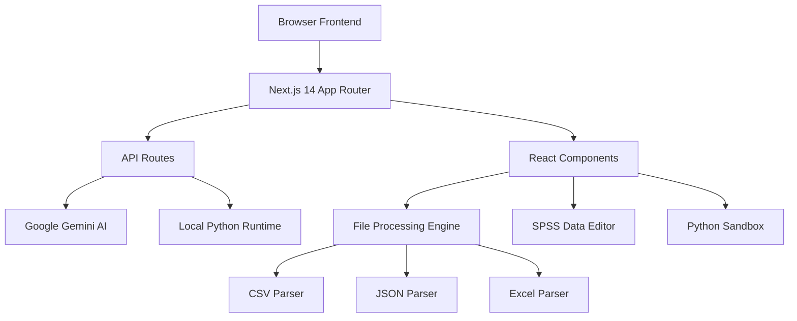
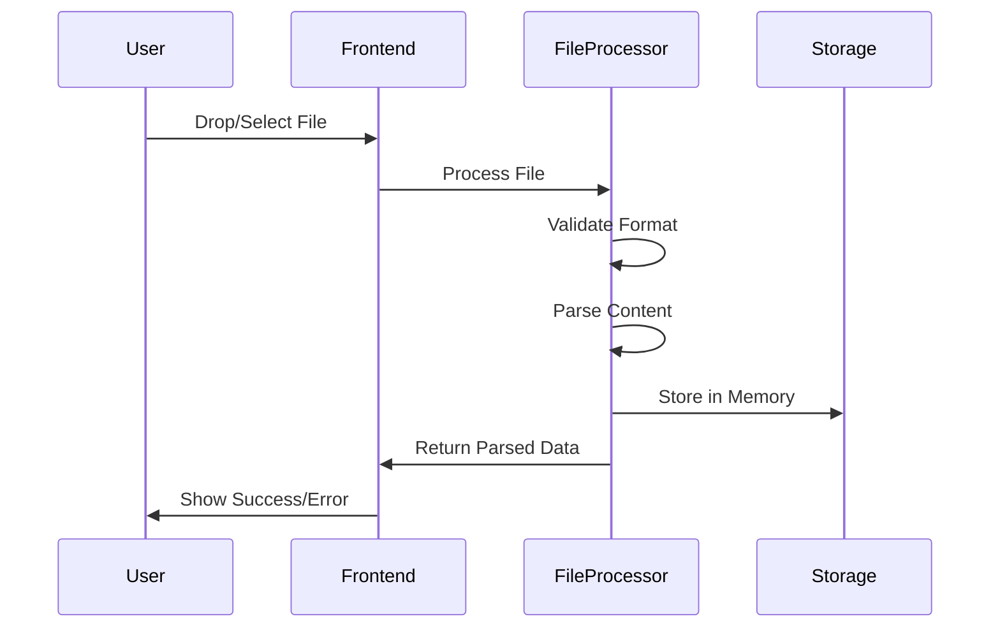
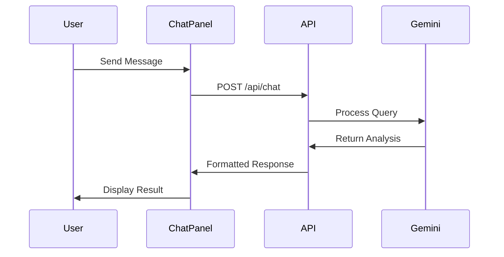

# Nemo - Technical Documentation

## 📋 Table of Contents

- [Architecture Overview](#architecture-overview)
- [Technology Stack](#technology-stack)
- [Project Structure](#project-structure)
- [Data Flow](#data-flow)
- [API Endpoints](#api-endpoints)
- [Component Architecture](#component-architecture)
- [State Management](#state-management)
- [File Processing Pipeline](#file-processing-pipeline)
- [AI Integration](#ai-integration)
- [Python Code Execution](#python-code-execution)
- [Performance Optimizations](#performance-optimizations)
- [Security Considerations](#security-considerations)
- [Development Workflow](#development-workflow)
- [Deployment](#deployment)

---

## Architecture Overview

Nemo is built as a modern, client-side web application with the following architectural principles:

### Core Architecture
- **Client-Side First**: All data processing happens in the browser for privacy and security
- **Microservices Approach**: Modular components with clear separation of concerns
- **API-Driven**: RESTful APIs for AI integration and Python execution
- **Responsive Design**: Mobile-first approach with desktop optimization

### System Components


### Design Patterns
- **Component Composition**: Reusable UI components with clear interfaces
- **Separation of Concerns**: Data processing, UI rendering, and business logic are separated
- **Event-Driven Architecture**: User interactions trigger state changes and API calls
- **Progressive Enhancement**: Core functionality works without JavaScript, enhanced with interactive features

---

## Technology Stack

### Frontend Framework
- **Next.js 14**: React framework with App Router for modern web development
- **React 18**: UI library with concurrent features and hooks
- **TypeScript**: Static type checking for robust code

### Styling & UI
- **Tailwind CSS**: Utility-first CSS framework for rapid styling
- **shadcn/ui**: Pre-built, customizable component library
- **Lucide React**: Modern icon library with consistent styling

### State Management
- **React Hooks**: useState, useRef, useEffect for local component state
- **Local Storage**: Browser storage for user preferences and configuration
- **Context Pattern**: For shared state across components when needed

### Data Processing
- **Papaparse**: CSV parsing with automatic type detection
- **xlsx**: Excel file processing for .xlsx and .xls files
- **JSON.parse**: Native JSON parsing with error handling

### AI & External Services
- **Google Gemini AI**: Natural language processing and data analysis
- **Custom API Routes**: Server-side integration with external services

### Development Tools
- **ESLint**: Code quality and consistency enforcement
- **Prettier**: Code formatting and style consistency
- **TypeScript Compiler**: Type checking and transpilation

---

## Project Structure

```
nemo/
├── app/                          # Next.js 14 App Router
│   ├── api/                      # API route handlers
│   │   ├── chat/route.ts         # Gemini AI integration
│   │   └── execute-python/route.ts # Python code execution
│   ├── globals.css               # Global styles
│   ├── layout.tsx                # Root layout component
│   └── page.tsx                  # Main application page
├── components/                   # React components
│   ├── ui/                       # shadcn/ui base components
│   ├── chat-panel.tsx            # AI chat interface
│   ├── data-panel.tsx            # File upload and management
│   ├── data-visualizations.tsx   # Chart and graph components
│   ├── markdown-renderer.tsx     # AI response rendering
│   ├── python-sandbox.tsx        # Interactive Python environment
│   └── spss-data-view.tsx        # Professional data editor
├── docs/                         # Documentation files
│   ├── FAQ.md                    # Frequently asked questions
│   ├── TECHNICAL_DOCUMENTATION.md # This file
│   ├── USER_GUIDE.md             # Detailed user instructions
│   └── ROADMAP.md                # Future development plans
├── hooks/                        # Custom React hooks
│   └── use-toast.ts              # Toast notification hook
├── lib/                          # Utility libraries
│   ├── env-config.ts             # Environment configuration
│   └── utils.ts                  # Common utility functions
├── public/                       # Static assets
├── types/                        # TypeScript type definitions
├── .env                          # Environment variables
├── .gitignore                    # Git ignore rules
├── next.config.js                # Next.js configuration
├── package.json                  # Dependencies and scripts
├── tailwind.config.js            # Tailwind CSS configuration
├── tsconfig.json                 # TypeScript configuration
└── README.md                     # Project overview
```

---

## Data Flow

### File Upload Process


### AI Chat Process


### Python Code Execution
```mermail
sequenceDiagram
    participant User
    participant Sandbox
    participant API
    participant Python

    User->>Sandbox: Write/Run Code
    Sandbox->>API: POST /api/execute-python
    API->>Python: Execute Code
    Python->>API: Return Output
    API->>Sandbox: Formatted Result
    Sandbox->>User: Display Output
```

---

## API Endpoints

### POST /api/chat
Handles AI-powered data analysis requests.

**Request Body:**
```json
{
  "message": "string",       // User's question
  "fileData": "array",       // Dataset for analysis
  "fileName": "string",      // Name of the dataset
  "model": "string",         // Gemini model to use
  "apiKey": "string"         // User's API key
}
```

**Response:**
```json
{
  "response": "string",      // AI-generated analysis
  "error": "string"          // Error message if any
}
```

**Error Codes:**
- `400`: Invalid request format
- `401`: Invalid or missing API key
- `429`: Rate limit exceeded
- `500`: Server error

### POST /api/execute-python
Executes Python code with uploaded data.

**Request Body:**
```json
{
  "code": "string",          // Python code to execute
  "fileName": "string",      // Dataset filename
  "fileData": "array"        // Dataset as JSON array
}
```

**Response:**
```json
{
  "output": "string",        // Execution output
  "error": "string",         // Error message if any
  "exitCode": "number"       // Process exit code
}
```

**Security Measures:**
- Code execution timeout (30 seconds)
- Limited filesystem access
- No network access from executed code
- Output size limits

---

## Component Architecture

### Core Components

#### DataPanel
**Purpose**: File upload, management, and tool navigation
**Key Features**:
- Drag-and-drop file upload
- File format validation and parsing
- Collapsible sidebar with tool icons
- Theme toggle and settings access

**State Management**:
```typescript
interface DataPanelState {
  uploadedFiles: UploadedFile[]
  isDragging: boolean
  isDarkMode: boolean
  selectedTab: 'files' | 'charts' | 'python'
}
```

#### ChatPanel
**Purpose**: AI-powered data analysis interface
**Key Features**:
- Real-time chat with AI
- Model selection and configuration
- Markdown rendering with syntax highlighting
- Python code execution integration

**State Management**:
```typescript
interface ChatPanelState {
  messages: Message[]
  inputMessage: string
  isLoading: boolean
  selectedModel: string
  apiKey: string
}
```

#### SPSSDataView
**Purpose**: Professional data editor with SPSS-like interface
**Key Features**:
- Data View for direct data editing
- Variable View for metadata configuration
- Find and replace functionality
- Excel-style keyboard navigation

**State Management**:
```typescript
interface SPSSDataViewState {
  data: any[][]
  variables: VariableInfo[]
  selectedCell: [number, number]
  isEditing: boolean
  findDialogOpen: boolean
}
```

#### PythonSandbox
**Purpose**: Interactive Python code execution environment
**Key Features**:
- Syntax-highlighted code editor
- Pre-built statistical analysis templates
- Real-time code execution
- Output visualization

---

## State Management

### Local Component State
Most components use React hooks for local state management:

```typescript
// File upload state
const [uploadedFiles, setUploadedFiles] = useState<UploadedFile[]>([])

// UI interaction state
const [isLoading, setIsLoading] = useState(false)
const [selectedFile, setSelectedFile] = useState<UploadedFile | null>(null)
```

### Persistent Storage
User preferences and configuration are stored in browser's localStorage:

```typescript
// API configuration
localStorage.setItem('gemini-api-key', apiKey)
localStorage.setItem('gemini-model', selectedModel)

// Theme preference
localStorage.setItem('theme', isDarkMode ? 'dark' : 'light')
```

### Prop Drilling Pattern
State is passed down through component hierarchy:

```typescript
// Parent component manages global state
const [uploadedFiles, setUploadedFiles] = useState<UploadedFile[]>([])
const [selectedFile, setSelectedFile] = useState<UploadedFile | null>(null)

// Child components receive state and updaters
<DataPanel 
  uploadedFiles={uploadedFiles}
  setUploadedFiles={setUploadedFiles}
  selectedFile={selectedFile}
  setSelectedFile={setSelectedFile}
/>
```

---

## File Processing Pipeline

### Supported Formats

#### CSV Processing
```typescript
const parseCSV = (content: string): any[] => {
  return Papa.parse(content, {
    header: true,
    skipEmptyLines: true,
    dynamicTyping: true,
    transformHeader: (header) => header.trim(),
    transform: (value, header) => {
      // Handle missing values
      if (value === '' || value === 'N/A' || value === 'null') {
        return null
      }
      return value
    }
  }).data
}
```

#### Excel Processing
```typescript
const parseExcel = (buffer: ArrayBuffer): any[] => {
  const workbook = XLSX.read(buffer, { type: 'buffer' })
  const sheetName = workbook.SheetNames[0]
  const worksheet = workbook.Sheets[sheetName]
  return XLSX.utils.sheet_to_json(worksheet, { 
    defval: null,
    raw: false
  })
}
```

#### JSON Processing
```typescript
const parseJSON = (content: string): any[] => {
  const data = JSON.parse(content)
  // Ensure data is array format
  if (Array.isArray(data)) {
    return data
  } else if (typeof data === 'object') {
    return [data]
  }
  throw new Error('Invalid JSON format')
}
```

### Data Type Detection
Automatic type detection for optimal analysis:

```typescript
const detectDataType = (value: any): DataType => {
  if (value === null || value === undefined) return 'missing'
  if (typeof value === 'number') return 'numeric'
  if (typeof value === 'boolean') return 'boolean'
  if (isDateString(value)) return 'date'
  return 'string'
}
```

### Error Handling
Comprehensive error handling throughout the pipeline:

```typescript
try {
  const data = await parseFile(file)
  // Success handling
} catch (error) {
  if (error instanceof Error) {
    toast.error(`Parse error: ${error.message}`)
  } else {
    toast.error('Unknown parsing error occurred')
  }
}
```

---

## AI Integration

### Google Gemini Integration

#### Model Selection
```typescript
const AVAILABLE_MODELS = {
  'gemini-1.5-flash': 'Fast responses, good for general analysis',
  'gemini-1.5-pro': 'Most capable, best for complex analysis',
  'gemini-pro': 'Balanced performance and capability'
}
```

#### Request Processing
```typescript
const generateAIResponse = async (prompt: string, context: any[]) => {
  const genAI = new GoogleGenerativeAI(apiKey)
  const model = genAI.getGenerativeModel({ model: selectedModel })

  const systemPrompt = `You are a data analysis expert. Analyze the provided dataset and answer questions about it. Provide clear, actionable insights.`
  
  const fullPrompt = `${systemPrompt}\n\nDataset: ${JSON.stringify(context.slice(0, 100))}\n\nQuestion: ${prompt}`
  
  const result = await model.generateContent(fullPrompt)
  return result.response.text()
}
```

#### Error Handling
```typescript
const handleAIError = (error: any) => {
  if (error.status === 401) {
    return 'Invalid API key. Please check your configuration.'
  } else if (error.status === 429) {
    return 'Rate limit exceeded. Please try again later.'
  } else if (error.status === 400) {
    return 'Invalid request. Please try a different question.'
  }
  return 'AI service temporarily unavailable.'
}
```

### Response Processing

#### Markdown Rendering
AI responses are rendered with full markdown support:

```typescript
const MarkdownRenderer = ({ content, onRunCode }) => {
  return (
    <ReactMarkdown
      components={{
        code({ node, inline, className, children, ...props }) {
          const match = /language-(\w+)/.exec(className || '')
          return !inline && match ? (
            <SyntaxHighlighter
              style={tomorrow}
              language={match[1]}
              PreTag="div"
              {...props}
            >
              {String(children).replace(/\n$/, '')}
            </SyntaxHighlighter>
          ) : (
            <code className={className} {...props}>
              {children}
            </code>
          )
        }
      }}
    >
      {content}
    </ReactMarkdown>
  )
}
```

---

## Python Code Execution

### Security Model

#### Sandboxed Execution
```typescript
const executePythonCode = async (code: string, data: any[]) => {
  // Create temporary data file
  const dataFile = path.join(tmpDir, `data_${Date.now()}.json`)
  await fs.writeFile(dataFile, JSON.stringify(data))

  // Prepare Python environment
  const pythonCode = `
import pandas as pd
import numpy as np
import matplotlib.pyplot as plt
import seaborn as sns
import sys
import json

# Load data
with open('${dataFile}', 'r') as f:
    data = json.load(f)
df = pd.DataFrame(data)

# User code
${code}
`

  // Execute with timeout and limited permissions
  const result = await execFile('python3', ['-c', pythonCode], {
    timeout: 30000,
    maxBuffer: 1024 * 1024, // 1MB output limit
    cwd: tmpDir
  })

  // Cleanup
  await fs.unlink(dataFile)
  
  return result
}
```

#### Template System
Pre-built analysis templates for common tasks:

```typescript
const TEMPLATES = {
  frequency: `
# Frequency Analysis
for column in df.select_dtypes(include=['object', 'category']).columns:
    print(f"\\n{column} - Frequency Distribution:")
    print(df[column].value_counts())
    print(f"Missing values: {df[column].isnull().sum()}")
`,
  
  descriptive: `
# Descriptive Statistics
print("Dataset Shape:", df.shape)
print("\\nData Types:")
print(df.dtypes)
print("\\nDescriptive Statistics:")
print(df.describe(include='all'))
print("\\nMissing Values:")
print(df.isnull().sum())
`,

  ttest: `
# T-Test Analysis
import scipy.stats as stats

numeric_columns = df.select_dtypes(include=[np.number]).columns
if len(numeric_columns) >= 2:
    col1, col2 = numeric_columns[0], numeric_columns[1]
    statistic, p_value = stats.ttest_ind(df[col1].dropna(), df[col2].dropna())
    print(f"T-test between {col1} and {col2}:")
    print(f"Statistic: {statistic:.4f}")
    print(f"P-value: {p_value:.4f}")
    print(f"Significant: {'Yes' if p_value < 0.05 else 'No'}")
else:
    print("Need at least 2 numeric columns for t-test")
`
}
```

---

## Performance Optimizations

### Client-Side Optimizations

#### Virtual Scrolling for Large Datasets
```typescript
const VirtualizedDataGrid = ({ data, rowHeight = 40 }) => {
  const [visibleRange, setVisibleRange] = useState({ start: 0, end: 100 })
  
  const handleScroll = useCallback((e) => {
    const scrollTop = e.target.scrollTop
    const containerHeight = e.target.clientHeight
    const start = Math.floor(scrollTop / rowHeight)
    const end = Math.min(start + Math.ceil(containerHeight / rowHeight) + 5, data.length)
    
    setVisibleRange({ start, end })
  }, [rowHeight, data.length])

  const visibleData = data.slice(visibleRange.start, visibleRange.end)
  
  return (
    <div onScroll={handleScroll} style={{ height: '400px', overflow: 'auto' }}>
      {visibleData.map((row, index) => (
        <DataRow key={visibleRange.start + index} data={row} />
      ))}
    </div>
  )
}
```

#### Memoization for Expensive Calculations
```typescript
const DataVisualizations = memo(({ data }) => {
  const chartData = useMemo(() => {
    return processDataForCharts(data)
  }, [data])

  const statistics = useMemo(() => {
    return calculateStatistics(data)
  }, [data])

  return (
    <div>
      <Charts data={chartData} />
      <Statistics data={statistics} />
    </div>
  )
})
```

#### Debounced Search
```typescript
const useDebounceSearch = (searchTerm: string, delay: number) => {
  const [debouncedTerm, setDebouncedTerm] = useState(searchTerm)

  useEffect(() => {
    const timer = setTimeout(() => setDebouncedTerm(searchTerm), delay)
    return () => clearTimeout(timer)
  }, [searchTerm, delay])

  return debouncedTerm
}
```

### Memory Management

#### Efficient Data Storage
```typescript
// Store only necessary data, avoid duplicating large datasets
interface UploadedFile {
  id: string
  name: string
  type: string
  size: number
  data: any[] // Raw data stored once
  metadata?: DatasetMetadata // Computed once, cached
}

// Lazy computation of expensive properties
const getDatasetMetadata = (data: any[]): DatasetMetadata => {
  if (!data.length) return { columns: [], rowCount: 0 }
  
  return {
    columns: Object.keys(data[0]),
    rowCount: data.length,
    columnTypes: detectColumnTypes(data),
    hasNullValues: checkForNullValues(data)
  }
}
```

#### Garbage Collection
```typescript
// Clean up large objects when components unmount
useEffect(() => {
  return () => {
    // Clear large data references
    setUploadedFiles([])
    setSelectedFile(null)
    
    // Force garbage collection hint
    if (window.gc) window.gc()
  }
}, [])
```

---

## Security Considerations

### Client-Side Security

#### Input Validation
```typescript
const validateFileInput = (file: File): boolean => {
  // File type validation
  const allowedTypes = ['text/csv', 'application/json', 'application/vnd.ms-excel']
  if (!allowedTypes.includes(file.type)) {
    throw new Error(`Unsupported file type: ${file.type}`)
  }

  // File size validation
  const maxSize = 100 * 1024 * 1024 // 100MB
  if (file.size > maxSize) {
    throw new Error(`File too large: ${file.size} bytes`)
  }

  return true
}
```

#### API Key Protection
```typescript
// API keys are stored in localStorage, never in code
const getApiKey = (): string => {
  const key = localStorage.getItem('gemini-api-key')
  if (!key) {
    throw new Error('API key not configured')
  }
  return key
}

// Keys are sent securely to backend
const makeSecureRequest = async (data: any) => {
  const response = await fetch('/api/chat', {
    method: 'POST',
    headers: {
      'Content-Type': 'application/json',
      'Authorization': `Bearer ${getApiKey()}`
    },
    body: JSON.stringify(data)
  })
  
  return response.json()
}
```

### Server-Side Security

#### Python Code Sandboxing
```typescript
const executePythonSafely = async (code: string) => {
  // Timeout protection
  const timeout = 30000 // 30 seconds

  // Memory limits
  const maxBuffer = 1024 * 1024 // 1MB

  // Filesystem isolation
  const tempDir = await fs.mkdtemp(path.join(os.tmpdir(), 'python-'))

  try {
    const result = await execFile('python3', ['-c', code], {
      timeout,
      maxBuffer,
      cwd: tempDir,
      env: {
        PYTHONPATH: tempDir,
        PYTHONDONTWRITEBYTECODE: '1'
      }
    })

    return result
  } finally {
    // Always cleanup
    await fs.rm(tempDir, { recursive: true, force: true })
  }
}
```

#### Rate Limiting
```typescript
const rateLimitMap = new Map<string, number[]>()

const checkRateLimit = (clientId: string, limit: number = 60): boolean => {
  const now = Date.now()
  const windowStart = now - 60000 // 1 minute window
  
  if (!rateLimitMap.has(clientId)) {
    rateLimitMap.set(clientId, [])
  }
  
  const requests = rateLimitMap.get(clientId)!
  const recentRequests = requests.filter(time => time > windowStart)
  
  if (recentRequests.length >= limit) {
    return false
  }
  
  recentRequests.push(now)
  rateLimitMap.set(clientId, recentRequests)
  
  return true
}
```

---

## Development Workflow

### Local Development Setup

#### Prerequisites
```bash
# Node.js 18+
node --version

# Python 3.7+ (for code execution)
python3 --version

# Git
git --version
```

#### Installation
```bash
# Clone repository
git clone <repository-url>
cd nemo

# Install dependencies
npm install

# Set up environment variables
cp .env.example .env
# Edit .env with your configuration

# Run development server
npm run dev
```

#### Development Scripts
```json
{
  "scripts": {
    "dev": "next dev",
    "build": "next build",
    "start": "next start",
    "lint": "next lint",
    "type-check": "tsc --noEmit",
    "test": "jest",
    "test:watch": "jest --watch"
  }
}
```

### Code Quality Tools

#### ESLint Configuration
```json
{
  "extends": [
    "next/core-web-vitals",
    "@typescript-eslint/recommended"
  ],
  "rules": {
    "@typescript-eslint/no-unused-vars": "error",
    "@typescript-eslint/no-explicit-any": "warn",
    "react-hooks/exhaustive-deps": "error"
  }
}
```

#### TypeScript Configuration
```json
{
  "compilerOptions": {
    "target": "es5",
    "lib": ["dom", "dom.iterable", "es6"],
    "allowJs": true,
    "skipLibCheck": true,
    "strict": true,
    "forceConsistentCasingInFileNames": true,
    "noEmit": true,
    "esModuleInterop": true,
    "module": "esnext",
    "moduleResolution": "node",
    "resolveJsonModule": true,
    "isolatedModules": true,
    "jsx": "preserve",
    "incremental": true,
    "plugins": [{ "name": "next" }],
    "baseUrl": ".",
    "paths": {
      "@/*": ["./*"]
    }
  }
}
```

### Testing Strategy

#### Unit Testing
```typescript
// Example component test
import { render, screen } from '@testing-library/react'
import { DataPanel } from '@/components/data-panel'

describe('DataPanel', () => {
  it('renders file upload area', () => {
    render(<DataPanel {...defaultProps} />)
    expect(screen.getByText('Drop files here')).toBeInTheDocument()
  })

  it('handles file upload', async () => {
    const mockSetFiles = jest.fn()
    render(<DataPanel {...defaultProps} setUploadedFiles={mockSetFiles} />)
    
    const file = new File(['test'], 'test.csv', { type: 'text/csv' })
    // Test file upload logic
  })
})
```

#### Integration Testing
```typescript
// API route testing
import { POST } from '@/app/api/chat/route'

describe('/api/chat', () => {
  it('processes chat request', async () => {
    const request = new Request('http://localhost', {
      method: 'POST',
      body: JSON.stringify({
        message: 'Test question',
        fileData: [{ col1: 'value1' }],
        model: 'gemini-1.5-flash'
      })
    })

    const response = await POST(request)
    expect(response.status).toBe(200)
  })
})
```

---

## Deployment

### Production Build

#### Build Optimization
```bash
# Create optimized production build
npm run build

# Start production server
npm start
```

#### Environment Configuration
```bash
# Production environment variables
NODE_ENV=production
GEMINI_API_KEY=your_production_api_key
NEXT_PUBLIC_APP_URL=https://your-domain.com
```

### Deployment Platforms

#### Vercel Deployment
```json
{
  "name": "nemo",
  "version": 2,
  "builds": [
    {
      "src": "package.json",
      "use": "@vercel/next"
    }
  ],
  "env": {
    "GEMINI_API_KEY": "@gemini-api-key"
  }
}
```

#### Docker Deployment
```dockerfile
FROM node:18-alpine AS builder
WORKDIR /app
COPY package*.json ./
RUN npm ci --only=production

FROM node:18-alpine AS runner
WORKDIR /app
COPY --from=builder /app/node_modules ./node_modules
COPY . .
RUN npm run build

EXPOSE 3000
CMD ["npm", "start"]
```

#### Performance Monitoring
```typescript
// Web Vitals tracking
import { getCLS, getFID, getFCP, getLCP, getTTFB } from 'web-vitals'

getCLS(console.log)
getFID(console.log)
getFCP(console.log)
getLCP(console.log)
getTTFB(console.log)
```

---

## Future Technical Enhancements

### Planned Architecture Improvements

#### Database Integration
- PostgreSQL with Prisma ORM
- User authentication and session management
- Persistent data storage and sharing

#### Real-time Features
- WebSocket integration for collaborative editing
- Real-time data updates and synchronization
- Live chat and collaboration features

#### Advanced Analytics
- Machine learning model integration
- Advanced statistical analysis
- Custom visualization engine

#### Performance Optimizations
- Service worker for offline functionality
- Advanced caching strategies
- CDN integration for static assets

This technical documentation provides a comprehensive overview of Nemo's architecture, implementation details, and development practices. It serves as a reference for developers working on the project and for understanding the technical decisions behind the application.